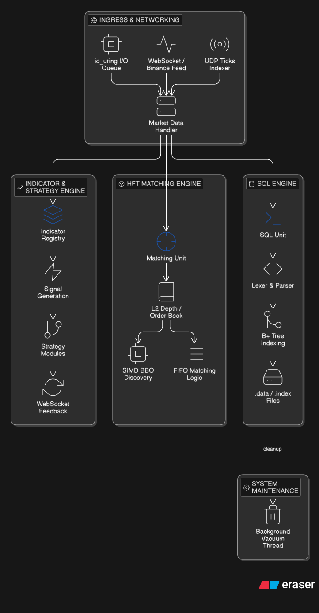

# NanoVaultDB

NanoVaultDB is a high-performance experimental database and matching engine written in C++, designed for low-latency workloads and constrained environments.

## Key Highlights

- Custom B+ Tree storage engine
- Low-latency FIFO matching engine
- SIMD-optimized hot paths
- Lock-free / low-allocation data paths
- Sub-microsecond critical operations (microbenchmarked)

NanoVaultDb is implemented from scratch in C++20. The system is engineered for "Mechanical Sympathy," optimizing software execution with a deep understanding of underlying hardware architectures, including CPU cache hierarchies, SIMD instruction sets, and asynchronous kernel I/O.



The entire system is governed by a set of high-performance engineering constraints designed to eliminate non-deterministic behavior and maximize instruction throughput.

## Performance Benchmarks

Benchmarks were conducted on:

- **CPU**: Intel Core i7-13620H (13th Gen)
- **Cores/Threads**: 10 cores / 16 threads
- **Max Frequency**: 4.9 GHz
- **Environment**:
  - Thread pinned to isolated CPU core
  - Real-time scheduling policy (SCHED_FIFO)
  - Pre-allocated memory (no runtime allocations)
  - Disk I/O disabled during benchmark
  - Warm-up phase executed before measurement

### Methodology

- Synthetic packet workload (pre-generated pool of 1M packets)
- Zero-copy packet reuse to avoid allocation overhead
- High-resolution timing via custom benchmarking utility
- Focus on **hot-path latency** (not end-to-end system latency)

### System Performance Benchmarks (CPU Pinned, Real-time Priority)

| Scale    | Min      | Mean     | P50 (Median) | P90      | P99       | P99.9     |
| :------- | :------- | :------- | :----------- | :------- | :-------- | :-------- |
| **100K** | 17.00 ns | 32.48 ns | 27.00 ns     | 32.00 ns | 103.00 ns | 273.00 ns |
| **1M**   | 16.00 ns | 33.04 ns | 28.00 ns     | 35.00 ns | 98.00 ns  | 256.00 ns |
| **10M**  | 16.00 ns | 32.75 ns | 28.00 ns     | 35.00 ns | 98.00 ns  | 257.00 ns |
| **100M** | 15.00 ns | 32.09 ns | 27.00 ns     | 35.00 ns | 97.00 ns  | 255.00 ns |

## Memory Hierarchy Performance (L1, L2, RAM)

Results gathered using `cachebenchmark.cpp` (1,000,000 iterations per test, pinned to CPU 1):

| Level         | Min      | Mean      | P50 (Median) | P90       | P99       | P99.9     |
| :------------ | :------- | :-------- | :----------- | :-------- | :-------- | :-------- |
| **L1 Load**   | 11.00 ns | 13.33 ns  | 13.00 ns     | 14.00 ns  | 15.00 ns  | 19.00 ns  |
| **L2 Load**   | 11.00 ns | 15.21 ns  | 14.00 ns     | 17.00 ns  | 27.00 ns  | 40.00 ns  |
| **RAM Load**  | 12.00 ns | 101.12 ns | 96.00 ns     | 117.00 ns | 234.00 ns | 288.00 ns |
| **L1 Store**  | 10.00 ns | 12.84 ns  | 13.00 ns     | 13.00 ns  | 16.00 ns  | 21.00 ns  |
| **RAM Store** | 11.00 ns | 19.29 ns  | 18.00 ns     | 19.00 ns  | 89.00 ns  | 157.00 ns |

## Hardware-Level Performance Analysis (100M+ Scale)

Detailed CPU metrics captured via `perf stat` during ultra-scale packet processing (pinned to Isolated Core):

| Metric                                  | Value                    |
| :-------------------------------------- | :----------------------- |
| **Instructions Per Cycle (IPC)**        | 2.19                     |
| **Core Clock Frequency**                | 4.671 GHz                |
| **Branch Prediction Accuracy**          | 98.92% (1.08% miss rate) |
| **Execution Efficiency (TMA Retiring)** | 38.9%                    |
| **Backend Bound (Stalled)**             | 39.8%                    |
| **Frontend Bound (Stalled)**            | 12.2%                    |
| **Speculation Overhead**                | 9.1%                     |

### Latency Summary (Ultra-Scale)

- **Mean Latency**: 21.52 ns
- **P50 (Median)**: 18.00 ns
- **P99 (Tail)**: 99.00 ns

## Usage & Interaction

### 1. Local CLI Access

The database can be accessed via the terminal using the installed CLI:

```bash
nanovault
```

### 2. Remote WebSocket Access (Python)

A Python script is provided to interact with the database remotely:

```bash
# Install dependencies
pip install websockets

# Run interactive client
python3 test_client.py
```

### 3. systemd Service Management

The engine runs automatically as a background service:

```bash
# Check status
sudo systemctl status nanovaultdb

# Restart service
sudo systemctl restart nanovaultdb
```

### 4. HFT & SQL Usage Syntax

NanoVaultDB uses a SQL-like DSL for real-time HFT operations. Below are common commands for managing indicators, strategies, and exchange feeds:

#### Indicator & Strategy Management

```sql
-- Add an indicator from a shared source
ADD HFT INDICATOR FROM FILE '/path/to/indicator.cpp';

-- Initialize an indicator (e.g., SMA) on a specific symbol
ADD INDICATOR "sma" ("10") ON SYMBOL 2 COLUMN_NO 0 TICKS 1;

-- Add and enable strategies
ADD STRATEGY FROM FILE '/path/to/strategy.cpp';
ENABLE STRATEGY "again" ("10") ON SYMBOL 1 COLUMN_NO 0 TICKS 1;

-- Monitor active strategies or list tables
LIST STRATEGY;
LIST TABLE "btc_ticks";
```

#### Binance Exchange Integration

```sql
-- Configure Order Book tracking for a symbol
SET BINANCE ORDER_BOOK ON SYMBOL 2 SYMBOL "BTCUSDT";

-- Configure Data Feeds (OHLC and Live Orders)
SET BINANCE DATA FEED OHLC "1s" ON SYMBOL 2 SYMBOL "BTCUSDT";
SET BINANCE DATA FEED LIVE ORDERS ON SYMBOL 3 SYMBOL "BTCUSDT";

-- Enable order execution
SET BINANCE API_KEY "your_api_key";
SET BINANCE ORDER EXECUTE;
```

#### Table Creation & Batch Writing

```sql
-- Create optimized HFT tables
CREATE HFT TABLE btc_trades (
    event_time     DOUBLE PRECISION 0,
    trade_id       DOUBLE PRECISION 0,
    price          DOUBLE PRECISION 8,
    quantity       DOUBLE PRECISION 8,
    trade_time     DOUBLE PRECISION 0,
    is_buyer_maker DOUBLE PRECISION 0
) SYMBOL 3;

-- Enable high-speed batch writing to disk
ENABLE BATCH WRITING ON TABLE "btc_ticks" TICKS 1;
```

### Zero-Allocation Hot Path

The system utilizes custom `MemoryPool`. This eliminates OS-level heap interaction during runtime, preventing memory fragmentation and potential pauses associated with standard allocation.

### Hardware-Aware Memory Layout

Data structures are meticulously aligned to 64-byte boundaries to match CPU cache line sizes. Padding is utilized to prevent false sharing in multi-threaded contexts, ensuring that independent execution threads do not contend for the same cache lines.

### Asynchronous Kernel-Level I/O (`io_uring`)

Leveraging Linux `io_uring`, the engine performs high-speed, non-blocking network and disk I/O. By utilizing shared submission and completion queues between user-space and kernel-space, the system minimizes context switching and achieves superior throughput for both market data ingestion and binary data persistence.

---

## 2. Advanced SQL Engine Analysis

The SQL engine provides a relational interface with persistent storage and optimized indexing.

### Custom Lexer and Parser

A hand-rolled Lexer and recursive-descent Parser transform SQL queries into an Abstract Syntax Tree (AST). This allows for highly optimized query evaluation without the overhead of heavy third-party parsing libraries.

### B+ Tree Indexing System

The engine implements a multi-way B+ Tree for primary and unique key indexing.

- **Dynamic Rebalancing**: Ensures O(log N) lookup, insertion, and deletion complexity.
- **Persistence**: Index structures are rebuilt automatically on server restart from high-speed binary `.index` files.
- **Index-Safe Operations**: Updates and deletions maintain structural integrity through atomic pointer swaps and node rebalancing.

### Background Vacuum and Cleanup

A specialized background vacuum thread periodically cleanses the database by:

- Compacting `.data` and `.index` files to remove deleted records.
- Rebuilding B+ Trees to maintain optimal branching factors.
- Utilizing atomic file replacement to ensure crash consistency during cleanup.

---

## 3. HFT Matching Engine Deep-Dive

The HFT module is a production-grade matching engine designed for sub-microsecond execution on Binance market feeds.

### FIFO Matching Algorithm

The system implements a strict Price-Time Priority (FIFO) matching algorithm across Bid and Ask ladders.

- **L2 Market Depth**: Tracks real-time liquidity across all price levels.
- **Fixed-Point Arithmetic**: All prices and quantities are handled as 64-bit integers scaled by 1e8, ensuring deterministic math and avoiding floating-point jitter.
- **O(1) Order Management**: An internal hash map provides instantaneous order retrieval for cancellations and modifications, bypassing the need for linear scans.

- **Parallel BBO Discovery**: SIMD primitives allow the engine to scan multiple price levels simultaneously to identify the Best Bid and Offer.

---

## 4. Extensible Indicator and Strategy Engine

The platform features a modular engine for real-time technical analysis and algorithmic execution.

### Plug-and-Play Indicator System

A registry-based architecture allows for the seamless integration of technical indicators (e.g., SMA, EMA, RSI).

- **Zero-Latency Ingress**: Indicators process incoming market data deltas directly from the dispatcher.
- **Stateful Analysis**: Each indicator maintains its own rolling window of historical data, optimized for minimal memory traversal.

### Algorithmic Strategy Engine

Strategies are implemented as standalone modules that consume indicator outputs and order book events.

- **Signal Generation**: Strategies can trigger Buy/Sell signals based on complex logic (e.g., OBI - Order Book Imbalance, price crossovers).
- **WebSocket Feedback Loop**: Internal execution decisions and signals are automatically broadcast via high-speed WebSockets for real-time visibility.

---

## 5. High-Performance Networking Stack

### WebSockets and UDP Ingest

- **Binance Ingestion**: A specialized, non-allocating JSON parser scans incoming WebSocket frames in-place, extracting depth updates with minimal CPU cycles.
- **UDP Receiver**: Optimized for high-frequency tick data (e.g., `btc_ticks`), utilizing raw socket descriptors and direct memory mapping where applicable.

### Binary Logging and Persistence

The system utilizes a compact binary stream format for data persistence.

- **Symbol-Indexed Storage**: Data is partitioned by symbol into dedicated subdirectories to prevent I/O contention.
- **Batch Writing**: Configurable batching thresholds (e.g., per-tick or per-period) optimize disk throughput by minimizing `pwrite` system calls.

---

## 5. Performance Metrics

| Component           | Operation             | Latency  |
| ------------------- | --------------------- | -------- |
| **Matching Engine** | Resting Order (Limit) | 11.4 ns  |
| **Matching Engine** | Match Round-Trip      | 132.3 ns |

---

## 6. Project Structure and Module Responsibility

### Core Database System

- `main.cpp`: System entry point, REPL execution, and orchestrator.
- `SQL_PARSER.hpp` / `SQL_LEXER.hpp`: Custom language processing stack.
- `initialLoad.hpp`: Cold-boot sequence and metadata recovery.

- `batchWriter.hpp` / `io_uring_queue.hpp`: Low-level I/O abstraction.

### HFT Infrastructure (`hft_clean/`)

- `hft_clean/include/order_book.hpp`: Core matching engine logic.
- `hft_clean/include/memory_pool.hpp`: Zero-garbage slab allocator.
- `hft_clean/src/exchange_adapter.cpp`: Optimized Binance JSON parsing engine.
- `hft_clean/src/market_data_handler.cpp`: Sequencing and routing dispatcher.

---

## 7. Engineering Philisophy: Mechanical Sympathy

NanoVaultDb is not merely a database; it is a demonstration of hardware-software co-design. By meticulously controlling memory layouts, instruction paths, and I/O scheduling, the system achieves level of performance typically reserved for institutional-grade proprietary trading systems.

---

## ⚠️ Limitations

- **Microbenchmark Scope**: Current performance figures are based on isolated microbenchmarks; end-to-end system latency may vary based on OS scheduling and network jitter.
- **Fault Tolerance**: Focused on raw throughput and latency; advanced replication and high-availability features are currently in the experimental phase.
- **Single-Node Optimization**: The engine is heavily tuned for vertical scaling and single-node performance rather than distributed horizontal scaling.
- **Protocol Ecosystem**: While it supports high-speed binary and WebSocket interfaces, it lacks compatibility with standard SQL drivers (ODBC/JDBC) found in mature RDBMS.

## 📚 Learnings

- **Mechanical Sympathy**: Validated that software performance is inextricably linked to hardware awareness—optimizing for L1/L2 cache lines and CPU pinning yields 10x gains over generic implementations.
- **Zero-Allocation Philosophy**: Learned that avoiding the heap in the hot path is the only way to achieve deterministic, "jitter-free" sub-microsecond latency.
- **Asynchronous I/O Mastery**: Implementing `io_uring` revealed the limitations of traditional synchronous system calls when processing millions of packets per second.
- **Data Structure Alignment**: Discovered that even subtle misalignments in memory or "false sharing" between threads can create massive performance bottlenecks in high-frequency matching engines.
- **Fixed-Point Precision**: The necessity of using fixed-point arithmetic instead of floating-point to ensure mathematical determinism and avoid rounding errors in financial matching loops.
